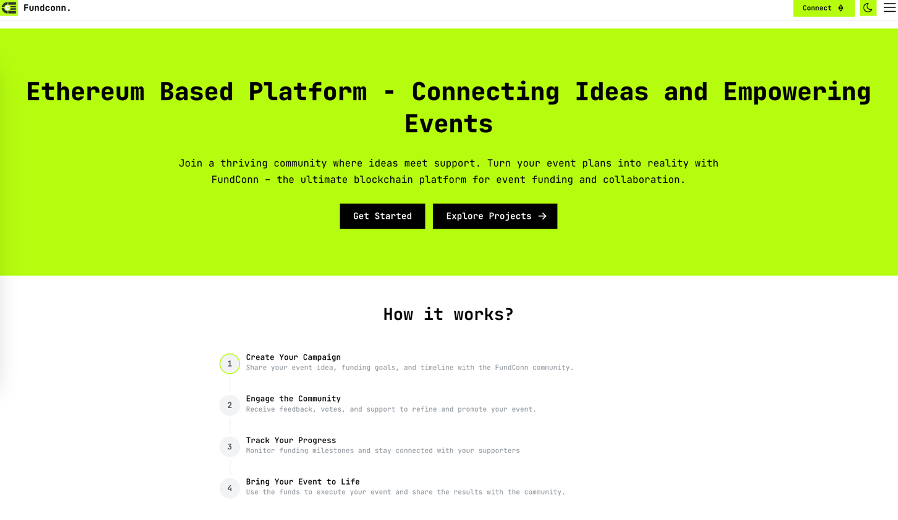
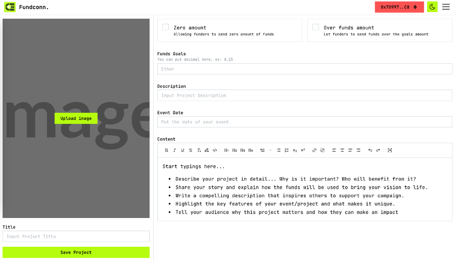

## Setup

If you are developing a production application, we recommend you to:

- Start the server by using command, docker-compose up -d in this directory
- Then run `start.sh` file:

> Journal

- [paper](preview/paper.pdf)

## Architecture

## Preview

